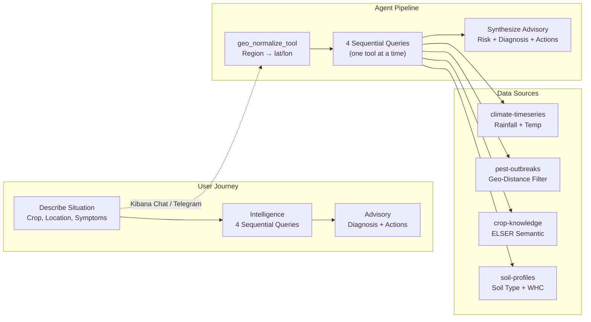
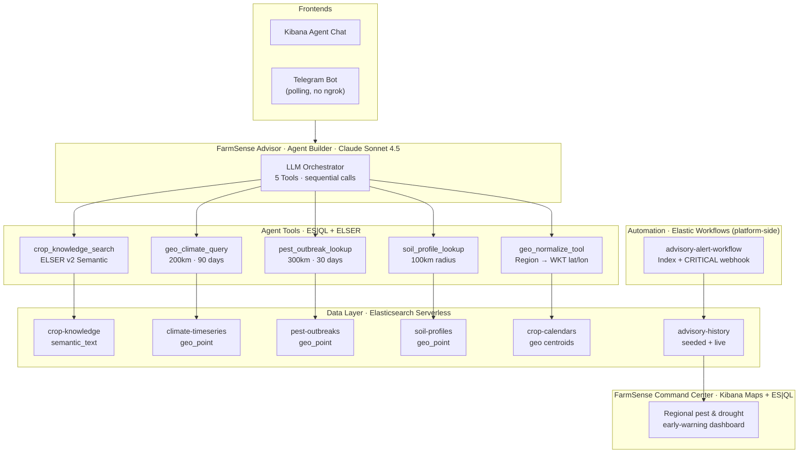
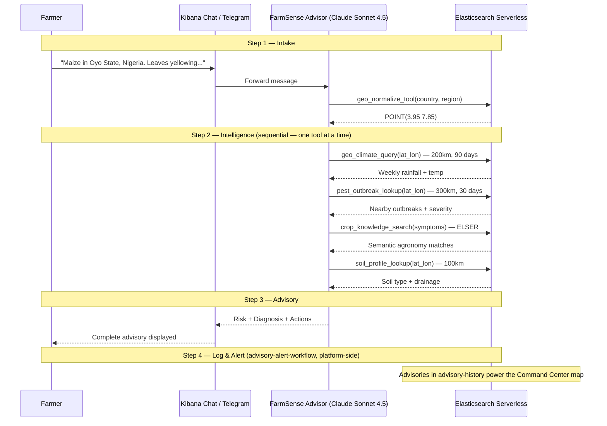

# FarmSense — AI Agronomist for Smallholder Farmers

*AI agronomist in your pocket — free, instant, hyper-local.*

Deliver hyper-contextual crop advisories by reasoning across open datasets — built for extension workers and smallholder farmers, on **Elastic Agent Builder**.

---

> ### ⚠️ Demo requirement (read first)
> In **Kibana → Agent Builder → Agent Chat**, select **`Anthropic Claude Sonnet 4.5`** as the model **before** sending a message. The default Agent Builder model fails silently (it calls tools with empty arguments). The Telegram bot sets this automatically. See [`demo/DEMO_RUNBOOK.md`](demo/DEMO_RUNBOOK.md).

---

## Quick Highlights
- **Hyper-Contextual Advisories:** Synthesizes geo-aware climate analysis, semantic crop knowledge, regional pest outbreaks, and soil profile matching into one plain-language advisory.
- **Real-Time Intelligence:** Uses ES|QL and `geo_point` filters to fetch recent rainfall and local pest alerts within milliseconds.
- **Semantic Crop Knowledge:** Leverages ELSER v2 for semantic search across FAO/CGIAR agronomic guidance ("leaves look weird" → "chlorosis").
- **FarmSense Command Center:** A Kibana Maps + ES|QL dashboard that turns every advisory into a **regional pest & drought early-warning map** — one dataset, a second product surface.
- **Automated Alerts & Audits:** An Elastic Workflow logs advisories to `advisory-history` and fires a webhook on CRITICAL pest risk.
- **Realistic Synthetic Data:** Pre-loaded with seasonal rainfall, ISRIC-style soil profiles, and realistic pest outbreaks (e.g., Fall Armyworm).

---

## High Level Workflow



### User Flow

| Step | Phase | What Happens |
|------|-------|-------------|
| **1** | **Intake** | Farmer describes situation (crop, location, symptoms, rain) in plain language via Kibana Chat or Telegram |
| **2** | **Intelligence** | Agent normalizes the location, then runs 4 queries **one at a time** (Climate, Pest, Agronomy, Soil) |
| **3** | **Advisory** | Synthesizes data into a concrete advisory with risk level, primary diagnosis, and actions |
| **4** | **Action & Log** | The `advisory-alert-workflow` (platform-side) logs the advisory for auditing and triggers a webhook if risk is CRITICAL |

> **Why sequential?** In the Agent Builder chat UI, tools invoked in *parallel* can be sent empty arguments and loop until they fail. The agent is instructed to call tools strictly one-at-a-time, which makes the pipeline reliable. (See *Design Decisions*.)

---

## The Problem
When smallholder farmers face crop issues or strange weather patterns:
- **Generic Advice:** Manuals provide static information that isn't tailored to the farmer's specific soil, recent local climate, or emerging regional pest outbreaks.
- **Accessibility:** Access to expert agronomists is limited, expensive, and slow.
- **Usability:** Existing tools require complex forms rather than understanding natural language.
- **No Integration:** No tool answers: *"Based on the exact rainfall in my region over the last 30 days and my local soil type, what is causing my maize leaves to curl?"*

## The Solution
FarmSense is a consumer-friendly AI agronomist that:
- **Ingests** your natural-language description of crop issues and location.
- **Simulates** an expert's reasoning by cross-referencing 4 independent data streams (Climate, Pest, Soil, Crop Guidelines).
- **Delivers** a concrete, plain-language advisory with actionable immediate and preventive steps.
- **Aggregates** every advisory into the **Command Center** — a regional early-warning map for NGOs and extension services — plus an audit trail and autonomous CRITICAL alerts.

---

## Architecture and Technical Overview

### System Architecture



### Data Pipeline



### Technical Deep Dive
**Geo-Aware Climate Analysis** — ES|QL + `geo_point` query weekly rainfall and temperature within a 200 km radius over the last 90 days.

**Semantic Crop Knowledge** — ELSER v2 matches the farmer's symptom descriptions to known agronomic issues across FAO/CGIAR guidelines.

**Regional Pest Outbreaks** — geo-distance filtering finds active outbreaks (FAO EMPRES-style) within 300 km of the farmer's coordinates.

**Command Center** — Kibana Maps renders `advisory-history` as risk-colored points; ES|QL `STATS`/`BUCKET` panels show risk mix, top pests, crops at risk, and trend over time. See [`demo/command_center.md`](demo/command_center.md).

---

## Tech Stack
| Layer | Technology | Purpose |
|---|---|---|
| Search & Storage | Elasticsearch Serverless | Vector, lexical, and geo-spatial data store |
| Agent Framework | Elastic Agent Builder | Orchestrates the LLM, tools, and chat |
| LLM | **Anthropic Claude Sonnet 4.5** (via Elastic `.inference` connector) | Tool-calling + advisory synthesis |
| Semantic Search | ELSER v2 | Semantic retrieval over agronomic text |
| Geo / Time-series | ES\|QL, `geo_point` | Fast analytical queries for climate and proximity |
| Visualization | Kibana Maps + Lens (ES\|QL) | Command Center early-warning dashboard |
| Automation | Elastic Workflows | Audit logging and CRITICAL alerts |
| Ingestion & Backend | Python 3.10+, `uv` | Populate indices and configure the agent |

---

## Quick Start

### Prerequisites
- Python 3.10+ with `uv`
- An **Elasticsearch Serverless** project ([sign up free](https://cloud.elastic.co/))
- **Kibana** access with **Agent Builder**, and an **Anthropic Claude** `.inference` connector available (Claude Sonnet 4.5 recommended)

### Step 1: Install
```bash
uv sync
cp .env.example .env   # then fill in ES_URL + ES_API_KEY
```

### Step 2: One-Command Setup
```bash
./do_everything.sh
```
This creates the 6 indices, ingests synthetic data, and creates the **5 agent tools + FarmSense Advisor** via the Kibana Agent Builder API (and attempts ELSER + the advisory workflow).

### Step 3: Seed the Command Center
```bash
uv run python ingestion/seed_advisory_history.py --reset      # ~220 advisories across 11 countries
```

### Step 4: Chat
1. Open **Kibana → Agent Builder → Agent Chat**
2. **Select model: `Anthropic Claude Sonnet 4.5`** ⚠️
3. Select agent: **FarmSense Advisor**
4. Send a farmer message (see [Demo Walkthrough](#demo-walkthrough)) — the full pipeline runs automatically (~40–70s)

### Step 5 (optional): Build the Command Center dashboard
Follow [`demo/command_center.md`](demo/command_center.md) — a Kibana Map + ES|QL panels over `advisory-history` (the data view and validated queries are ready to go).

---

## ELSER Setup (Semantic Search)
`crop_knowledge_search` uses **ELSER v2** (`.elser-2-elasticsearch`). If it isn't deployed, that tool returns nothing but the agent still produces advisories from climate, pest, and soil data.

Deploy via **Kibana → Machine Learning → Trained Models** (Start), or:
```bash
uv run python agent_config/start_elser.py
```
First deploy downloads + starts the model (can take several minutes) — warm it once before a demo.

## Advisory Workflow (Audit Logging + Critical Alerts)
The `advisory-alert-workflow` indexes advisories to `advisory-history` and sends a webhook when risk is CRITICAL. It is created automatically by:
```bash
uv run python agent_config/create_workflow_via_kibana_api.py
```
> **Note:** the workflow is **not** attached to the agent as a tool. In this Agent Builder preview, workflow-type tools don't expose their inputs to the LLM, so the model can't fill them. The workflow exists as a platform component — invoke it from the app layer or the Workflows UI, and view results in the Command Center.

---

## Demo Walkthrough

Open **Kibana → Agent Builder → Agent Chat**, set the model to **Claude Sonnet 4.5**, select **FarmSense Advisor**, and try:

| Scenario | Input | Expected |
|---|---|---|
| Maize, Nigeria | *"Maize in Oyo State, Nigeria. Leaves yellowing and curling. Very little rain for 3 weeks. 6-leaf stage."* | HIGH — drought stress |
| Rice, Bangladesh | *"Rice in Dhaka, Bangladesh. After floods, leaf spots and panicles turning brown. Very humid."* | CRITICAL — Rice Blast |
| Wheat, India | *"Wheat in Uttar Pradesh, India. Some aphids but crop looks healthy. Normal rainfall."* | MEDIUM — minor aphids |
| Cassava, Kenya | *"Cassava in Western Kenya. Leaves yellowing, plants stunted. Poor soil, no fertilizer."* | nutrient deficiency |
| Tomato, Ethiopia | *"Tomato in Oromia, Ethiopia. Dark lesions on leaves and stems. Cool and very humid."* | late blight |

Full runbook (incl. troubleshooting): [`demo/DEMO_RUNBOOK.md`](demo/DEMO_RUNBOOK.md).

---

## Telegram Bot Integration (Mobile Frontend)

A lightweight polling script runs entirely locally — no `ngrok` or webhooks. It calls the Agent Builder API and sets the Claude connector automatically.

1. Create a bot via [@BotFather](https://t.me/botfather) and add to `.env`:
   ```env
   TELEGRAM_BOT_TOKEN=your_bot_token_here
   ALLOWED_CHAT_IDS=123456789   # optional allowlist
   # ELASTIC_CONNECTOR_ID=Anthropic-Claude-Sonnet-4-5   # override if your connector id differs
   ```
2. Start the bot:
   ```bash
   uv run python telegram_poller.py
   ```
3. On Telegram, send `/start`, then a farming query — it streams progress and delivers the advisory.

---

## Agent Tools & Indices

### Agent Tools (5)
| Tool | Type | What it does |
|---|---|---|
| `geo_normalize_tool` | ES\|QL | Region name → `lat_lon` WKT (from `crop-calendars` centroids) |
| `geo_climate_query` | ES\|QL | Weekly rainfall/temp within 200 km, last 90 days |
| `pest_outbreak_lookup` | ES\|QL | Active outbreaks within 300 km, last 30 days |
| `soil_profile_lookup` | ES\|QL | Nearest soil profiles within 100 km |
| `crop_knowledge_search` | Index Search | ELSER semantic search on agronomic guidance |

> Plus the platform-side `advisory-alert-workflow` (Elastic Workflow) for audit logging + CRITICAL alerts — not an agent tool.

### Key Indices (Pre-loaded with Synthetic Data)
| Index | Modelled after | Documents | Purpose |
|---|---|---|---|
| `crop-knowledge` | FAO/CGIAR guides | ~7 | Text + ELSER `semantic_text` |
| `climate-timeseries` | NASA POWER weekly | ~3,200 | Weekly rainfall & temp by location |
| `pest-outbreaks` | FAO EMPRES reports | 7 | Outbreaks with `geo_point` + severity |
| `soil-profiles` | ISRIC SoilGrids | 6 | Soil type, drainage, water-holding capacity |
| `crop-calendars` | FAO crop calendar | 17 | Geo centroids for `geo_normalize_tool` |
| `advisory-history` | Audit log | ~220 seeded | Generated advisories — powers the Command Center |

---

## Project Structure
```text
farmsense/
├── agent_config/           # Kibana Agent Builder setup (tools, agent, ELSER, workflow)
├── ingestion/              # Index creation, data loading, advisory seeding
├── data/                   # Synthetic dataset CSV/JSONs
├── demo/                   # DEMO_RUNBOOK.md + command_center.md
├── workflows/              # Elastic Workflow YAML + JSON
├── tests/                  # Verification scripts
├── telegram_poller.py      # Telegram mobile frontend (polling)
├── telegram_server.py      # Shared Telegram helpers (+ optional webhook app)
├── orchestrator.py         # Agent + weather + localizer pipeline for Telegram
├── do_everything.sh        # One-command setup
└── pyproject.toml          # App dependencies
```

---

## Environment Variables
| Variable | Required | Description |
|---|---|---|
| `ES_URL` | Yes | Elasticsearch Serverless URL |
| `ES_API_KEY` | Yes | API key to authenticate with Elasticsearch (also used for Kibana APIs) |
| `ELASTIC_CONNECTOR_ID` | Optional | LLM connector id for the Telegram path (default `Anthropic-Claude-Sonnet-4-5`) |
| `TELEGRAM_BOT_TOKEN` | Optional | Required only for the Telegram frontend |
| `ALLOWED_CHAT_IDS` | Optional | Comma-separated allowlist of Telegram user IDs |
| `ALERT_WEBHOOK_URL` | Optional | Webhook fired on CRITICAL pest risk |

---

## Design Decisions
- **Claude Sonnet 4.5 for tool-calling:** the default Agent Builder model calls tools with empty arguments and fails. A strong tool-calling model is required; select it in the Chat model picker (the Telegram path sets it via `connector_id`).
- **Sequential, not parallel, intelligence gathering:** the Agent Builder chat UI can send empty arguments to tools invoked in parallel, causing retry loops. The agent is instructed to call tools strictly one-at-a-time, which is reliable end-to-end in ~40–70s.
- **ES|QL over traditional DSL:** geo-climate, pest, and soil tools use ES|QL for complex aggregations and geo-filtering in simple pipe-separated queries.
- **Workflow as a platform component, not an agent tool:** workflow-type tools don't expose inputs to the LLM in this preview, so logging/alerting runs via the Workflows engine (and the app layer) rather than an autonomous agent call.
- **One dataset, two products:** the same advisories that help individual farmers aggregate into the Command Center early-warning map — no extra pipelines.
- **Semantic first:** ELSER v2 powers crop knowledge search so "leaves are weird" matches "chlorosis" / "abnormal foliage".
- **Synthetic vs real data:** high-quality synthetic data guarantees the demo works anywhere, while schemas mirror real datasets (ISRIC, NASA POWER) for production upgrades.

---

## License
MIT License — see [LICENSE](LICENSE).
