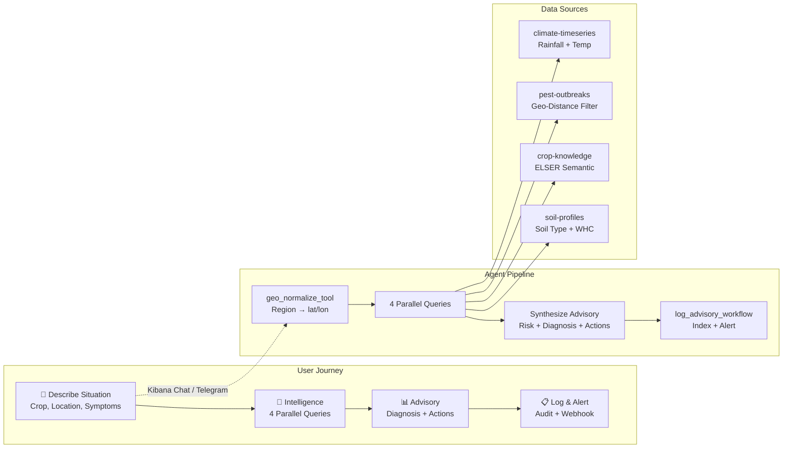
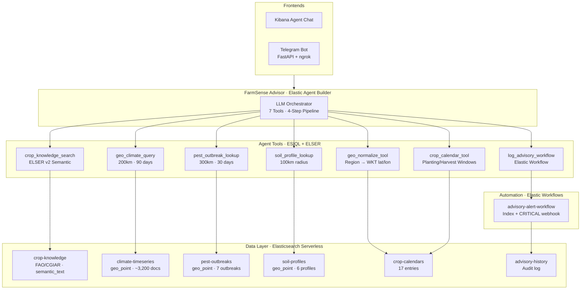
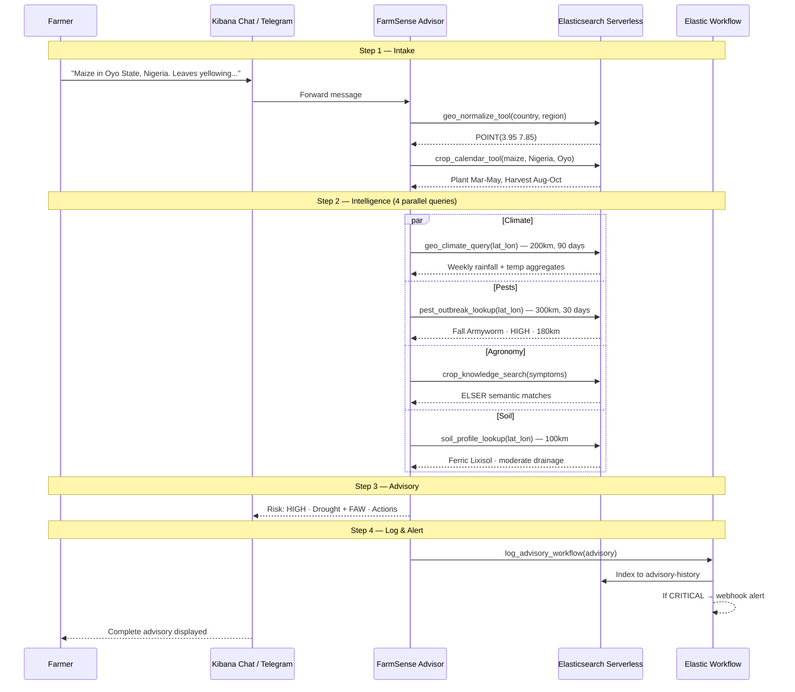

# 🌾 FarmSense — AI Agronomist for Smallholder Farmers
Python 3.10+ • Elasticsearch Serverless • License: MIT

*AI agronomist in your pocket — free, instant, hyper-local.*

Deliver hyper-contextual crop advisories by reasoning across open datasets — built for extension workers and smallholder farmers.

---

## Quick Highlights
- **Hyper-Contextual Advisories:** Synthesizes geo-aware climate analysis, semantic crop knowledge, regional pest outbreaks, and soil profile matching.
- **Real-Time Intelligence:** Uses ES|QL and `geo_point` filters to fetch exact recent rainfall and local pest alerts within milliseconds.
- **Semantic Crop Knowledge:** Leverages ELSER v2 for deep semantic search across FAO/CGIAR agronomic guidance.
- **Automated Alerts & Audits:** Elastic Workflows automatically log auditable alerts for critical pest risks.
- **Realistic Synthetic Data:** Pre-loaded with synthetic seasonal rainfall, ISRIC-style soil profiles, and realistic pest outbreaks (e.g., Fall Armyworm) to simulate a production environment.

---

## High Level Workflow



### User Flow

| Step | Phase | What Happens |
|------|-------|-------------|
| **1** | 💬 **Intake** | Farmer describes situation (crop, location, symptoms, rain) in plain language via Kibana Chat or Telegram |
| **2** | 🔬 **Intelligence** | Agent normalizes the location and runs 4 parallel queries (Climate, Pest, Agronomy, Soil) |
| **3** | 📊 **Advisory** | Synthesizes data into a concrete advisory with risk level, primary diagnosis, and actions |
| **4** | 📋 **Action & Log** | Logs the generated advisory for auditing. If risk is critical, triggers a webhook alert |

---

## The Problem
When smallholder farmers face crop issues or strange weather patterns:
- **Generic Advice:** Agricultural manuals provide static information that isn't tailored to the farmer's specific soil, recent local climate, or emerging regional pest outbreaks.
- **Accessibility:** Access to expert agronomists is limited, expensive, and slow.
- **Usability:** Existing digital tools require complex form-filling or institutional expertise to operate, rather than understanding natural language.
- **No Integration:** No tool answers: "Based on the exact rainfall in my region over the last 30 days and my local soil type, what is causing my maize leaves to curl?"

## The Solution
FarmSense is a consumer-friendly AI agronomist that:
- **Ingests** your natural language description of crop issues and location.
- **Simulates** an expert's reasoning by cross-referencing 4 independent data streams (Climate, Pest, Soil, Crop Guidelines).
- **Delivers** a concrete, plain-language advisory with actionable immediate and preventive steps.
- **Provides** a full audit trail and autonomous alerting for severe biological threats.

---

## Architecture and Technical Overview

### System Architecture



### Data Pipeline



### Technical Deep Dive
**Geo-Aware Climate Analysis**  
Using ES|QL and `geo_point` mapping, the agent queries weekly rainfall and temperature aggregates within a 200 km radius over the last 90 days.

**Semantic Crop Knowledge**  
Leveraging the ELSER v2 model, FarmSense performs semantic searches on agricultural guidelines (FAO/CGIAR), matching the farmer's symptom descriptions to known agronomic issues.

**Regional Pest Outbreaks**  
Queries active pest outbreaks (e.g., from FAO EMPRES reports) within a 300 km radius of the farmer's coordinates using geo-distance filtering.

---

## Tech Stack
| Layer | Technology | Purpose |
|---|---|---|
| Search & Storage | Elasticsearch Serverless | Core vector, lexical, and geo-spatial data store |
| Agent Framework | Elastic Agent Builder | Orchestrates the LLM, tools, and user interaction |
| Semantic Search | ELSER v2 | Deep semantic retrieval for text-heavy agronomic data |
| Geo / Time-series | ES\|QL, `geo_point` | Fast analytical queries for climate and proximity |
| Automation | Elastic Workflows | Audit logging and critical pest alerts |
| Ingestion & Backend| Python 3.10+, `uv` | Scripts to populate indices and configure the agent |

---

## Features
- **🌍 Geo-Normalization Assistant:** Automatically converts plain-text region names into precise lat/lon coordinates for downstream tools.
- **🌦️ Hyper-Local Climate Matching:** Analyzes exact recent rainfall trends instead of relying on generic seasonal assumptions.
- **🐛 Proximity-based Pest Alerts:** Filters verified pest outbreaks by exact distance to the farmer.
- **🌱 Soil-Aware Modelling:** Adapts advice based on whether the local soil is matching (e.g., sandy vs. clay, drainage capacity).
- **⏱️ Instant Advisory:** Full pipeline executes and returns a comprehensive guide in under 60 seconds.
- **🚨 Automated Critical Alerts:** Built-in Elastic Workflow integration to alert authorities or NGOs automatically if a critical pest threshold is met.

---

## Quick Start

### Prerequisites
- Python 3.10+ with `uv`
- An **Elasticsearch Serverless** project ([sign up free](https://cloud.elastic.co/))
- **Kibana** access (comes with your Elastic Cloud project)

### Step 1: Clone and Setup
```bash
git clone https://github.com/ankitlade12/farmsense.git
cd farmsense
```

### Step 2: Install Dependencies
```bash
uv sync
```

### Step 3: Configure Environment
```bash
cp .env.example .env
```
Edit `.env` and fill in:
```env
ES_URL=https://my-project-XXXXX.es.us-central1.gcp.elastic.cloud:443
ES_API_KEY=your_api_key_here
# KIBANA_URL is auto-derived from ES_URL (replaces .es. with .kb.)
# Override manually if needed:
# KIBANA_URL=https://my-project-XXXXX.kb.us-central1.gcp.elastic.cloud
```

### Step 4: One-Command Setup (Recommended)
```bash
./do_everything.sh
```
This single script will:
1. Create all 6 Elasticsearch indices with proper mappings (`geo_point`, `date`, `semantic_text`)
2. Ingest synthetic data — crop knowledge, crop calendars, climate time-series, pest outbreaks, soil profiles
3. Create all 7 tools and the **FarmSense Advisor** agent via the Kibana Agent Builder API
4. Start ELSER (if available)

### Step 4 (Alternative): Step-by-Step Setup
```bash
# Create indices
uv run python ingestion/create_indices.py

# Ingest data (one script per index)
uv run python ingestion/ingest_crop_knowledge.py
uv run python ingestion/ingest_crop_calendars.py
uv run python ingestion/ingest_climate_data.py
uv run python ingestion/ingest_pest_outbreaks.py
uv run python ingestion/ingest_soil_profiles.py

# Create tools + FarmSense Advisor agent
uv run python agent_config/setup.py
```

### Step 5: Open Kibana and Chat
1. Open **Kibana** → **Agent Builder** → **Chat**
2. Select **FarmSense Advisor** from the agent dropdown
3. Send a farmer message — the full pipeline runs automatically

---

## Detailed Kibana Setup

### Using the Agent in Kibana Chat
After running the setup script, your agent and tools are ready:
1. Navigate to **Kibana → Agent Builder → Chat**
2. Select **FarmSense Advisor** from the dropdown
3. Send any farmer scenario, for example:
   > *"I'm growing maize in Oyo State, Nigeria. The leaves are turning yellow and curling. We've had very little rain for 3 weeks. Plants are at 6-leaf stage."*
4. The agent will automatically run the full 4-step pipeline (Intake → Intelligence → Advisory → Log)

### ELSER Setup (Semantic Search)
The `crop_knowledge_search` tool uses **ELSER v2** for semantic search. If ELSER isn't deployed, that tool times out but the agent still produces advisories using climate, pest, and soil data.

**To enable ELSER:**
1. Open **Kibana → Machine Learning → Trained Models** (or **Inference**)
2. Find **ELSER** (e.g. `.elser-2-elasticsearch`)
3. Click **Start** / **Deploy** and wait until status shows **Started**
4. Retry your farmer query — `crop_knowledge_search` should now return semantic matches

Or via script:
```bash
uv run python agent_config/start_elser.py
```

### Advisory Workflow Setup (Audit Logging + Critical Alerts)
Log every advisory to `advisory-history` and send a webhook alert when risk is CRITICAL.

1. **Create the workflow in Kibana:**
   - Open **Kibana → Workflows → Create workflow**
   - Name: `advisory-alert-workflow`
   - Open the YAML editor and paste the contents of `workflows/advisory_alert_workflow.yaml`
   - Save

2. **Attach the workflow tool to the agent:**
   ```bash
   uv run python agent_config/add_workflow_tool_to_advisor.py
   ```
   This creates the `log_advisory_workflow` tool and adds it to the FarmSense Advisor.

3. **Troubleshooting:** If workflow execution fails, check **Workflows → Executions**. Common fix — delete and recreate the `advisory-history` index:
   ```bash
   uv run python -c "
   import sys; sys.path.insert(0, 'ingestion')
   from dotenv import load_dotenv; load_dotenv('.env')
   from utils import get_es_client
   c = get_es_client()
   c.indices.delete(index='advisory-history', ignore_unavailable=True)
   "
   uv run python ingestion/create_indices.py
   ```

### Re-Apply ES|QL Query Fixes
If you edit tools in the Kibana UI and queries revert:
```bash
uv run python agent_config/fix_esql_tools.py
```

### Manual Kibana Setup (Fallback)
If the API-based setup fails, you can create everything by hand in the Kibana UI:

1. **Create ES|QL tools** — Agent Builder → Tools → New Tool → Type: ES|QL. Create these 5 tools with queries from `agent_config/setup.py`:
   - `geo_normalize_tool` — Resolve region to lat/lon
   - `crop_calendar_tool` — Planting/harvest windows
   - `geo_climate_query` — Weekly climate within 200 km
   - `pest_outbreak_lookup` — Outbreaks within 300 km
   - `soil_profile_lookup` — Soil profiles within 100 km

2. **Create Index Search tool:**
   - Name: `crop_knowledge_search`
   - Index: `crop-knowledge`
   - Type: Index Search (ELSER semantic search on `text_semantic`)

3. **Create the FarmSense Advisor agent:**
   - Name: `FarmSense Advisor`
   - Tools: all 7 tools above
   - Instructions: copy the `FARMSENSE_ADVISOR_INSTRUCTIONS` string from `agent_config/setup.py`

---

## Demo Walkthrough

1. Open **Kibana Agent Builder Chat**
2. Select **FarmSense Advisor**
3. Try any of these scenarios:

| Scenario | Input |
|---|---|
| 🌽 Maize, Nigeria — Drought + FAW | *"Maize in Oyo State, Nigeria. Leaves yellowing and curling. Very little rain for 3 weeks. 6-leaf stage."* |
| 🌾 Rice, Bangladesh — Flooding + Blast | *"Rice in Dhaka, Bangladesh. After floods, leaf spots and panicles turning brown. Very humid."* |
| 🌾 Wheat, India — Minor Aphids | *"Wheat in Uttar Pradesh, India. Some aphids on leaves but crop looks healthy. Normal rainfall."* |
| 🥔 Cassava, Kenya — Nutrient Deficiency | *"Cassava in Western Kenya. Leaves yellowing, plants stunted. Poor soil, no fertilizer."* |
| 🍅 Tomato, Ethiopia — Late Blight | *"Tomato in Oromia, Ethiopia. Dark lesions on leaves and stems. Cool and very humid."* |

4. Watch the agent normalize geo-location, query all 4 data streams, and return a structured advisory with risk level, diagnosis, and actions.

---

## Telegram Bot Integration (Mobile Frontend)

FarmSense includes a production-ready mobile frontend via Telegram, utilizing FastAPI and the Elastic Agent API.

1. **Create a bot** via [@BotFather](https://t.me/botfather) and add to `.env`:
   ```env
   TELEGRAM_BOT_TOKEN=your_bot_token_here
   ALLOWED_CHAT_IDS=123456789,987654321  # Optional: restrict access
   ```

2. **Start the FastAPI server:**
   ```bash
   uv run python telegram_server.py
   ```

3. **Expose locally via ngrok:**
   ```bash
   ngrok http 8000
   ```

4. **Register the webhook:**
   ```bash
   curl -F "url=https://<YOUR_NGROK_URL>/webhook" \
        https://api.telegram.org/bot<YOUR_BOT_TOKEN>/setWebhook
   ```

5. **Test it:** Open Telegram, find your bot, and send `/start` or a farming query!

---

## Agent Tools & Indices

### Key Indices (Pre-loaded with Synthetic Data)
| Index | Modelled after | Documents | Purpose |
|---|---|---|---|
| `crop-knowledge` | FAO/CGIAR guides | ~20 | Text + ELSER `semantic_text` for guidance |
| `climate-timeseries` | NASA POWER weekly | ~3,200 | Weekly rainfall & temp by location via `ts`, `point` |
| `pest-outbreaks` | FAO EMPRES reports | 7 | Outbreaks with `geo_point` and severity |
| `soil-profiles` | ISRIC SoilGrids | 6 | Soil type, drainage, water-holding capacity |
| `crop-calendars` | FAO crop calendar | 17 | Planting/harvest windows by country & region |
| `advisory-history` | Audit log | — | Generated advisories with risk levels |

### Agent Tools
| Tool | Type | What it does |
|---|---|---|
| `geo_normalize_tool` | ES\|QL | Region name → lat_lon WKT string for downstream tools |
| `crop_calendar_tool` | ES\|QL | Crop + region → planting/harvest months |
| `geo_climate_query` | ES\|QL | Weekly rainfall/temp within 200 km, last 90 days |
| `pest_outbreak_lookup` | ES\|QL | Active outbreaks within 300 km, last 30 days |
| `soil_profile_lookup` | ES\|QL | Nearest soil profiles within 100 km |
| `crop_knowledge_search`| Index Search | ELSER semantic search on agronomic guidance |
| `log_advisory_workflow`| Workflow | Log advisory + trigger CRITICAL alert webhook |

## Project Structure
```text
farmsense/
├── agent_config/           # Kibana Agent Builder setup tools
├── ingestion/              # Data loading scripts (mappings, ELSER, etc.)
├── data/                   # Synthetic dataset CSV/JSONs
├── demo/                   # Demo scenarios and sample outputs
├── workflows/              # Elastic Workflow YAML definitions
├── tests/                  # Verification scripts
├── do_everything.sh        # One-command setup
└── pyproject.toml          # App dependencies
```

---

## Environment Variables
| Variable | Required | Description |
|---|---|---|
| `ES_URL` | Yes | Elasticsearch Serverless URL |
| `ES_API_KEY` | Yes | API Key to authenticate with Elasticsearch |

---

## Design Decisions
- **ES|QL over traditional DSL:** We used ES|QL extensively for the geo-climate, pest, and soil tools to allow complex aggregations and geo-filtering in visually simple, fast pipe-separated queries.
- **Parallel Intelligence Gathering:** The agent is given explicit instructions to query climate, pest, and soil data *in parallel* to keep the user's wait time under 60 seconds.
- **Workflow-Driven Alerts:** Instead of building a custom backend, we utilized Elastic Workflows natively to listen for "CRITICAL" risk evaluations by the agent and dispatch webhooks.
- **Synthetic vs Real Data:** Current indices use high-quality synthetic data to guarantee the demo works reliably anywhere, while the schema perfectly mirrors real-world datasets (ISRIC, NASA POWER) for seamless production upgrades.
- **Semantic First:** ELSER v2 powers the crop knowledge search to ensure that when a farmer says "leaves are weird," the engine understands semantic equivalents like "chlorosis" or "abnormal foliage."

---

## License
MIT License — see [LICENSE](LICENSE) file for details.
